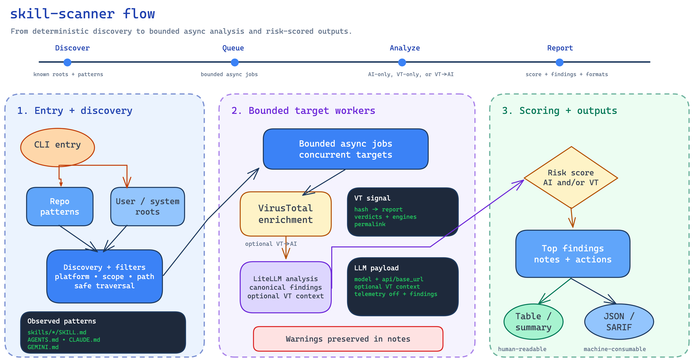

# skill-scanner

[](https://github.com/thedevappsecguy/skill-scanner/actions/workflows/ci.yml)
[](https://github.com/thedevappsecguy/skill-scanner/actions/workflows/publish-testpypi.yml)
[](https://github.com/thedevappsecguy/skill-scanner/actions/workflows/release.yml)
[](https://github.com/thedevappsecguy/skill-scanner/actions/workflows/zizmor.yml)
[](https://github.com/thedevappsecguy/skill-scanner/actions/workflows/github-code-scanning/codeql)
[](https://github.com/thedevappsecguy/skill-scanner/blob/main/LICENSE)
[](https://pypi.org/project/skill-scanner/)
[](https://github.com/thedevappsecguy/skill-scanner/blob/main/SECURITY.md)

`skill-scanner` reviews AI skill and instruction artifacts for security risk using:
- LiteLLM-based AI analysis
- VirusTotal analysis

## Architecture flow



## Requirements

- Python 3.11+
- [`uv`](https://docs.astral.sh/uv/)
- LiteLLM-compatible LLM configuration and/or VirusTotal API key (at least one analyzer)

## Install (from PyPI)

```bash
uv pip install skill-scanner
```

Base install includes LiteLLM-based AI analysis and VirusTotal support.

## Install (from source)

```bash
uv sync --group dev
```

Run with:

```bash
uv run skill-scanner --help
```

Alias:

```bash
uv run skillscan --help
```

## What gets scanned

By default, `discover` and `scan` detect markdown-based skill/instruction artifacts (for example `SKILL.md`, `AGENTS.md`, `CLAUDE.md`, `*.instructions.md`, `*.prompt.md`, `*.agent.md`, `.mdc`).

Validated skill locations also include:

- Windsurf: `.windsurf/skills/*/SKILL.md`, `~/.codeium/windsurf/skills/*/SKILL.md`
- Gemini CLI: `.gemini/skills/*/SKILL.md`, `~/.gemini/skills/*/SKILL.md` (`.agents/skills/*/SKILL.md` when `--platform gemini`)
- Cline: `.cline/skills/*/SKILL.md`, `.clinerules/skills/*/SKILL.md`, `~/.cline/skills/*/SKILL.md`, `~/.clinerules/skills/*/SKILL.md`
- OpenCode: `.opencode/skills/*/SKILL.md`, `~/.config/opencode/skills/*/SKILL.md` (`.agents/skills/*/SKILL.md` and `.claude/skills/*/SKILL.md` when `--platform opencode`)
- Claude marketplace/user variants: `.claude/skills/SKILL.md`, `.claude/skills/*/SKILL.md`, and
  `.claude/plugins/marketplaces/*/{plugins,external_plugins}/*/skills/*/SKILL.md`
- Documented agent profile locations: `.claude/agents/*.md`, `.gemini/agents/*.md`,
  `.gemini/extensions/*/agents/*.md`, `.opencode/agents/*.md`, `~/.config/opencode/agents/*.md`,
  `.github/agents/**/*.agent.md`, and `agents/*.agent.md`
- Skill discovery supports both flat and nested layouts: `skills/SKILL.md` and `skills/<name>/SKILL.md`

Use `--path` to target a specific file or folder.
`--path` discovery is deterministic and only emits files that match known discovery roots/patterns
(plus a direct `SKILL.md` at the provided path root). It does not treat arbitrary `*.md` files as targets.

Default discover behavior:

- `discover` attempts all scopes (`repo`, `user`, `system`, `extension`).
- `repo` scope is only active when your current directory is inside a git repository.
- Filesystem traversal errors are non-fatal; discovery returns partial results. Use `--verbose` to inspect warnings.

## Quick start

```bash
# See targets
uv run skill-scanner discover --format json

# Discover only user scope
uv run skill-scanner discover --scope user

# Show detailed discovery warnings
uv run skill-scanner discover --verbose

# Verify key/model configuration
uv run skill-scanner doctor

# Run live API checks (fails non-zero if checks fail)
uv run skill-scanner doctor --check

# Run a scan (with whichever analyzers are configured)
uv run skill-scanner scan --format summary
```

## Configuration

`scan` requires at least one analyzer enabled.

- There is no built-in model default. Set `SKILLSCAN_MODEL` explicitly or pass `--model`.
- If `SKILLSCAN_MODEL` plus either `SKILLSCAN_API_KEY` or `SKILLSCAN_BASE_URL` is available, AI runs.
- If only `VT_API_KEY` is available, VT runs and AI is disabled.
- If both AI config and `VT_API_KEY` are available, both analyzers run and VT context is passed into AI analysis.
- You can disable either analyzer with `--no-ai` or `--no-vt`.
- AI analysis requires an explicit `SKILLSCAN_MODEL` or `--model` value.

Use `doctor --check` to verify model/API/base URL connectivity.
Use [`models.litellm.ai`](https://models.litellm.ai/) to choose a supported LiteLLM model string.

Supported configuration paths:

1. Environment variables:

```bash
export SKILLSCAN_MODEL=openai/gpt-5.4
export SKILLSCAN_API_KEY=your-llm-key
export VT_API_KEY=your-vt-key
uv run skill-scanner scan --format summary
```

2. Local or user config file:

- project-local: `./skill-scanner.toml`
- user-level: `~/.config/skill-scanner/config.toml`

```toml
model = "openai/gpt-5.4"
api_key = "your-llm-key"
vt_api_key = "your-vt-key"
```

Local model config example:

```toml
model = "ollama/llama3.1"
base_url = "http://localhost:11434"
```

3. CLI overrides for a single run:

```bash
uv run skill-scanner scan \
  --model openai/gpt-5.4 \
  --api-key "$SKILLSCAN_API_KEY" \
  --format summary
```

Hosted model env example:

```bash
SKILLSCAN_MODEL=openai/gpt-5.4
SKILLSCAN_API_KEY=op://Developer/LLM/api_key
VT_API_KEY=op://Developer/VirusTotal/api_key
```

Local model example:

```bash
SKILLSCAN_MODEL=ollama/llama3.1
SKILLSCAN_BASE_URL=http://localhost:11434
```

## 1Password setup

Recommended approach: keep secrets out of `skill-scanner.toml` and store them as 1Password secret references in `.env`.

Example `.env`:

```bash
SKILLSCAN_MODEL=openai/gpt-5.4
SKILLSCAN_API_KEY=op://Developer/LLM/api_key
VT_API_KEY=op://Developer/VirusTotal/api_key
```

Run the scanner through 1Password CLI so those references are resolved at runtime:

```bash
op run --env-file=.env -- uv run skill-scanner scan --format summary
```

To verify configuration before scanning:

```bash
op run --env-file=.env -- uv run skill-scanner doctor --check
```

If you prefer shell exports instead of an env file:

```bash
export SKILLSCAN_MODEL=openai/gpt-5.4
export SKILLSCAN_API_KEY="$(op read 'op://Developer/LLM/api_key')"
export VT_API_KEY="$(op read 'op://Developer/VirusTotal/api_key')"
uv run skill-scanner scan --format summary
```

Important:
- `skill-scanner` does not auto-load `.env` files on its own.
- `op://...` references are resolved when you use `op run` or `op read`.
- If you want to keep secrets in a config template, render it first with `op inject`; do not commit the rendered file.

Security best practice:
- Prefer a 1Password Service Account scoped to only the vault/items required for scanning (least privilege).

## LiteLLM privacy

- `skill-scanner` disables LiteLLM telemetry before making SDK calls.
- `skill-scanner` clears LiteLLM callback hooks in its SDK integration path.
- `models.litellm.ai` is documentation for choosing model strings; the package does not query or sync it at runtime.

Reference:
- https://developer.1password.com/docs/cli/secret-references/
- https://developer.1password.com/docs/cli/reference/commands/run/
- https://developer.1password.com/docs/service-accounts/

## Output formats

`scan --format` supports:
- `table` (default)
- `summary`
- `json`
- `sarif`

You can write output to a file with `--output <path>`.
Interactive `table` and `summary` scans show a live Rich progress bar while targets are being analyzed.

## Useful commands

```bash
# List providers
uv run skill-scanner providers

# Scan one path only
uv run skill-scanner scan --path ./some/skill/folder --format summary

# Increase scan concurrency (default: 8)
uv run skill-scanner scan --jobs 16 --format summary

# Enable verbose logs for troubleshooting
uv run skill-scanner scan --verbose --format summary

# List discovered targets without running analyzers
uv run skill-scanner scan --list-targets

# Discover targets from user scope only
uv run skill-scanner discover --scope user --format table

# Discover with detailed traversal diagnostics
uv run skill-scanner discover --verbose --format table

# Scan only selected discovered targets (repeat --target)
uv run skill-scanner scan --target /absolute/path/to/SKILL.md --target /absolute/path/to/AGENTS.md --format summary

# Filter to medium+
uv run skill-scanner scan --min-severity medium --format summary

# Non-zero exit if high+ findings exist
uv run skill-scanner scan --fail-on high --format summary

# Verbose doctor checks
uv run skill-scanner doctor --check --verbose
```

`--list-targets` can be used without API keys because it only runs discovery and exits.

## Discovery troubleshooting (macOS/Windows)

```bash
# macOS/Windows: default discover should complete without crashing
uv run skill-scanner discover --format table

# Scoped check: verify user skill paths only
uv run skill-scanner discover --scope user --format table
```

Windows known-path sanity check:
- create `%USERPROFILE%\\.clinerules\\skills\\demo\\SKILL.md`
- run `uv run skill-scanner discover --platform cline --scope user --format table`
- confirm the demo skill appears in output

## Exit behavior

- `0`: scan completed and fail threshold not hit
- `1`: `--fail-on` threshold matched
- `2`: no analyzers enabled (for example missing keys combined with flags), or `--target` did not match any discovered target

`doctor --check` exit behavior:

- `0`: all executed checks passed
- `1`: one or more checks failed

## Notes and truncation visibility

`scan` now surfaces per-target notes in table and summary output, including:

- analyzer failures (LLM or VirusTotal)
- payload truncation when files are skipped due to the 400k-character AI payload limit
- unreadable files excluded from payload construction

## Contributing

See [CONTRIBUTING.md](./CONTRIBUTING.md) for setup, testing, and PR guidelines.

## Roadmap (in progress)

- [x] Improve system prompt hardening to uncover more threat patterns
- [x] Support multiple providers via LiteLLM model strings
- [ ] Baseline / suppression / false-positive management
- [x] Ollama / local LLM provider support via LiteLLM `base_url`
- [ ] Configurable risk scoring
- [ ] GitHub Actions template for automated scans
- [ ] Improve fixtures to include realistic malicious skills

## Version bump workflow

Use `uv version` so version updates stay command-driven and lock state remains consistent.

```bash
# Patch bump (e.g., 0.1.2 -> 0.1.3)
uv version --bump patch

# Or set an explicit version
uv version 0.3.0
```

Notes:
- `pyproject.toml` is the canonical version source.
- `uv.lock` is generated by uv and should not be edited manually.
